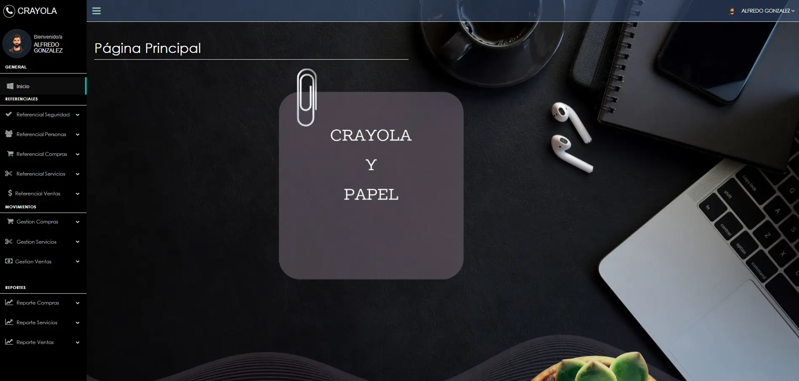
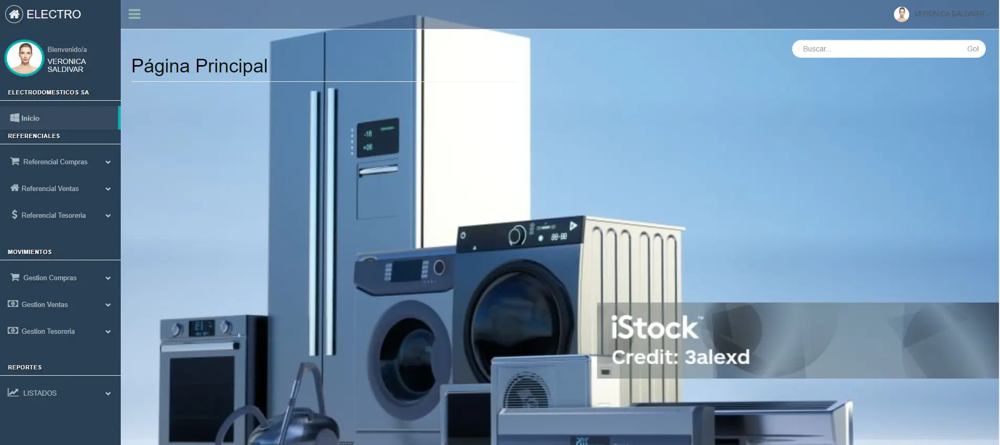
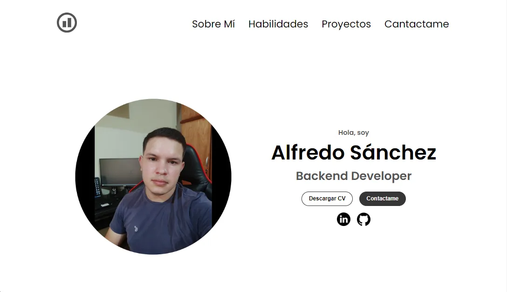

# Mi Portafolio

## Introducción
¡Hola! Soy Alfredo Daniel Sánchez, un desarrollador apasionado por la tecnología y la innovación. Este portafolio muestra mis proyectos destacados realizados.

## Habilidades
- **Lenguajes**: HTML, CSS, JavaScript, PHP, SQL
- **Frameworks y librerías**: Node JS, Express Js, Laravel, Bootstrap
- **Herramientas**: Git, GitHub

## Proyectos destacados
### CRAYOLA Y LAPIZ S. A
**Desarrollador FullStack** 
Asunción, Paraguay  *Ene 2024 – Oct 2024*
**Descripción**:
- **Gestión de compras**: Automatiza la creación y seguimiento de presupuesto de proveedores, además registra las compras, actualizando el stock disponible, evitando errores y faltantes.
- **Gestión de servicios**: Gestiona las reservas de turnos, órdenes de trabajos y agendas de los funcionarios.
- **Integración de ventas**: Centraliza la gestión de ventas, facilitando una visión completa de las operaciones y mejorando la planificación y control financiero.
- **Gestión de cobros multi-método**: Facilita el cobro a clientes mediante distintos métodos de pago, como efectivo, tarjeta y cheque, asegurando flexibilidad y rapidez en las transacciones.

**Tecnologías utilizadas**: 
* HTML, CSS, JavaScript, PHP, SQL, PostgreSQL, XAMPP.

**Capturas de pantalla**:

 

 ### ELECTRODOMESTICOS S. A
**Desarrollador FullStack** 
Asunción, Paraguay  *Ene 2023 – Feb 2024*
**Descripción**:
- **Gestión de compras**: Automatiza la creación y seguimiento de presupuesto de proveedores, además registra las compras, actualizando el stock disponible, evitando errores y faltantes.
- **Integración de ventas**: Centraliza la gestión de ventas, facilitando una visión completa de las operaciones y mejorando la planificación y control financiero.
- **Gestión de cobros multi-método**: Facilita el cobro a clientes mediante distintos métodos de pago, como efectivo, tarjeta y cheque, asegurando flexibilidad y rapidez en las transacciones.
- **Módulo de Tesorería**: Permite gestionar eficientemente los flujos de efectivo de la empresa, controlando ingresos y egresos en tiempo real. Facilita la conciliación bancaria automática, el seguimiento de pagos y cobros, y la planificación de la liquidez, mejorando la toma de decisiones financieras y asegurando un control preciso de las finanzas.

**Tecnologías utilizadas**: 
* HTML, CSS, JavaScript, PHP, SQL, PostgreSQL, XAMPP.

**Capturas de pantalla**:

 

### [Mi Portafolio Personal](https://alfredo-sanchez.github.io/portafolio/)
- **Descripción**: Este es mi portafolio donde muestro mis proyectos y habilidades. Utilicé técnicas de diseño responsivo para asegurarme de que se vea bien en todos los dispositivos.
- **Tecnologías utilizadas**: HTML, CSS, JavaScript.
- **Capturas de pantalla**: 

## Contacto
Si deseas saber más sobre mí o mis proyectos, no dudes en contactarme:
- **Correo electrónico**: alfredosanchez080114@gmail.com
- **LinkedIn**: [Alfredo en LinkedIn](https://www.linkedin.com/in/alfredo-sanchezg/)
- **GitHub**: [Alfredo en GitHub](https://github.com/Alfredo-Sanchez)

---

Gracias por visitar mi portafolio. ¡Espero que disfrutes explorándolo!
